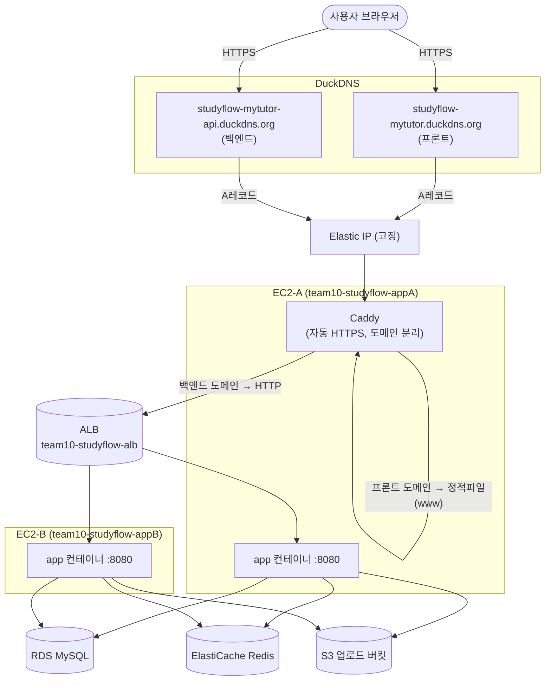
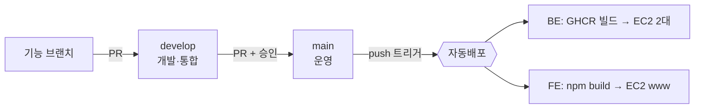

# StudyFlow AWS 배포 가이드 (EC2 2대 + ALB 멀티 인스턴스)

> 이 문서 하나로 **빈 AWS 계정에서 → 운영 서비스 + 자동배포**까지 그대로 재현할 수 있습니다.
> 2026-06-22~23 실제 배포 기록 기반. 리전 **ap-northeast-2(서울)**, 공유 데브코스 계정.
> 모든 리소스 이름은 `team10-studyflow-*` 규칙.

---

## 0. 한눈에 보는 전체 그림



### 핵심 원리 — "무상태(stateless)"가 왜 필요한가
EC2를 2대로 늘리면 사용자는 ALB를 통해 **둘 중 아무 서버로나** 분산됩니다. 그런데 서버가 데이터를 **자기 메모리/디스크에** 들고 있으면, A 서버에 저장한 걸 B 서버는 모릅니다. 그래서 상태를 전부 **모든 서버가 공유하는 외부 저장소**로 빼야 합니다:

| 무엇을 | 어디로 | 왜 |
|---|---|---|
| 화이트보드/오디오 상태, 로그인 토큰 | **Redis(ElastiCache)** | 두 서버가 같은 메모리 상태를 봄 |
| WebSocket 실시간 메시지 | **Redis Pub/Sub 릴레이** | A서버 사용자에게 갈 메시지가 B서버에서 나도 전달 |
| 업로드 파일(사진/PDF/오디오) | **S3** | A서버에 올린 파일을 B서버도 서빙 |
| DB | **RDS(MySQL)** | 원래부터 외부였지만, 컨테이너 밖으로 분리 |
| 스케줄러(@Scheduled) | **ShedLock(Redis 락)** | 2대가 동시에 같은 작업 중복 실행 방지 |

> 이 무상태화 코드는 `app.storage.type` 같은 **설정 토글**로 동작합니다. 로컬에선 디스크/단일 인스턴스, 운영에선 S3/멀티 인스턴스 — **코드는 하나**입니다.

---

## 1. 사전 준비

```bash
# AWS CLI 설치 후 프로파일 등록 (액세스 키 csv 기준)
aws configure --profile studyflow
#   AWS Access Key ID / Secret / region=ap-northeast-2 / output=json

# 확인
aws sts get-caller-identity --profile studyflow
```

- GitHub 레포 2개: 백엔드, 프론트엔드 (둘 다 `main`·`develop` 브랜치)
- DuckDNS 계정 (https://www.duckdns.org) — 도메인 2개 만들 예정
- LiveKit Cloud 키(화상수업용, 선택)

> 아래 명령은 전부 `--profile studyflow --region ap-northeast-2` 를 붙입니다. (편의상 `P="--profile studyflow --region ap-northeast-2"` 로 줄여 씁니다.)

---

## 2. 네트워크 (기본 VPC 사용)

별도 VPC 안 만들고 **기본 VPC + 퍼블릭 서브넷 2개(다른 AZ)** 를 씁니다. ALB·RDS·Redis가 최소 2 AZ를 요구하기 때문입니다.

```bash
P="--profile studyflow --region ap-northeast-2"
# 기본 VPC
aws ec2 describe-vpcs $P --filters "Name=isDefault,Values=true" --query "Vpcs[0].VpcId" --output text
# 퍼블릭 서브넷 목록 (AZ별로 하나씩 고른다 — 예: 2a, 2c)
aws ec2 describe-subnets $P --filters "Name=vpc-id,Values=<VPC_ID>" \
  --query "Subnets[?MapPublicIpOnLaunch].{Subnet:SubnetId,AZ:AvailabilityZone}" --output table
```
→ 예시 결과: AZ-a `subnet-aaa`, AZ-c `subnet-ccc` 선택.

---

## 3. 보안그룹 4개 (방화벽)

```
인터넷 ──80/443──> [sg-alb]            (Caddy/ALB 진입)
       [sg-app] <──8080── sg-alb       (앱은 ALB에서만 8080 받음)
                 <──22──── 내 IP/0.0.0.0/0 (SSH 배포)
       [sg-rds] <──3306── sg-app        (DB는 앱에서만)
       [sg-redis]<─6379── sg-app        (Redis는 앱에서만)
```
**원리**: DB·Redis는 인터넷에 절대 노출하지 않고 "앱 서버에서만" 접근하게 막습니다(SG 간 참조). 앱은 ALB에서만 8080을 받습니다.

```bash
VPC=<VPC_ID>
SG_ALB=$(aws ec2 create-security-group $P --group-name team10-studyflow-sg-alb --description "alb" --vpc-id $VPC --query GroupId --output text)
SG_APP=$(aws ec2 create-security-group $P --group-name team10-studyflow-sg-app --description "app" --vpc-id $VPC --query GroupId --output text)
SG_RDS=$(aws ec2 create-security-group $P --group-name team10-studyflow-sg-rds --description "rds" --vpc-id $VPC --query GroupId --output text)
SG_REDIS=$(aws ec2 create-security-group $P --group-name team10-studyflow-sg-redis --description "redis" --vpc-id $VPC --query GroupId --output text)

# ALB: 80/443 인터넷
aws ec2 authorize-security-group-ingress $P --group-id $SG_ALB --ip-permissions \
  'IpProtocol=tcp,FromPort=80,ToPort=80,IpRanges=[{CidrIp=0.0.0.0/0}]' \
  'IpProtocol=tcp,FromPort=443,ToPort=443,IpRanges=[{CidrIp=0.0.0.0/0}]'
# APP: 80/443(인터넷, Caddy용) + 8080(ALB/인스턴스간) + 22(SSH)
aws ec2 authorize-security-group-ingress $P --group-id $SG_APP --ip-permissions \
  'IpProtocol=tcp,FromPort=80,ToPort=80,IpRanges=[{CidrIp=0.0.0.0/0}]' \
  'IpProtocol=tcp,FromPort=443,ToPort=443,IpRanges=[{CidrIp=0.0.0.0/0}]' \
  'IpProtocol=tcp,FromPort=22,ToPort=22,IpRanges=[{CidrIp=0.0.0.0/0}]'
aws ec2 authorize-security-group-ingress $P --group-id $SG_APP --ip-permissions \
  "IpProtocol=tcp,FromPort=8080,ToPort=8080,UserIdGroupPairs=[{GroupId=$SG_ALB},{GroupId=$SG_APP}]"
# RDS / REDIS: 앱 SG에서만
aws ec2 authorize-security-group-ingress $P --group-id $SG_RDS   --ip-permissions "IpProtocol=tcp,FromPort=3306,ToPort=3306,UserIdGroupPairs=[{GroupId=$SG_APP}]"
aws ec2 authorize-security-group-ingress $P --group-id $SG_REDIS --ip-permissions "IpProtocol=tcp,FromPort=6379,ToPort=6379,UserIdGroupPairs=[{GroupId=$SG_APP}]"
```

---

## 4. S3 업로드 버킷

```bash
B=team10-studyflow-uploads
aws s3api create-bucket $P --bucket $B --create-bucket-configuration LocationConstraint=ap-northeast-2
# 퍼블릭 읽기 허용(브라우저가 직접 GET) — 차단 해제
aws s3api put-public-access-block $P --bucket $B --public-access-block-configuration \
  BlockPublicAcls=false,IgnorePublicAcls=false,BlockPublicPolicy=false,RestrictPublicBuckets=false
# 객체 공개 읽기 정책
aws s3api put-bucket-policy $P --bucket $B --policy \
 '{"Version":"2012-10-17","Statement":[{"Sid":"PublicRead","Effect":"Allow","Principal":"*","Action":"s3:GetObject","Resource":"arn:aws:s3:::team10-studyflow-uploads/*"}]}'
# ★ CORS — PDF.js가 fetch로 PDF를 읽으므로 필수 (이거 없으면 PDF만 "불러오지 못함")
aws s3api put-bucket-cors $P --bucket $B --cors-configuration \
 '{"CORSRules":[{"AllowedOrigins":["https://studyflow-mytutor.duckdns.org","http://localhost:5173"],"AllowedMethods":["GET","HEAD"],"AllowedHeaders":["*"],"ExposeHeaders":["Content-Length","Content-Range","Accept-Ranges","ETag"],"MaxAgeSeconds":3600}]}'
```
> **함정**: 이미지(``)·오디오(`<audio>`)는 태그 src라 CORS 불필요해서 잘 되는데, **PDF는 PDF.js가 fetch로 읽어서 CORS가 없으면 실패**합니다. 꼭 CORS를 넣으세요.

---

## 5. RDS (MySQL) — DB

```bash
# 서브넷 그룹 (2 AZ)
aws rds create-db-subnet-group $P --db-subnet-group-name team10-studyflow-db-subnet \
  --db-subnet-group-description "db" --subnet-ids <subnet-a> <subnet-c>
# 인스턴스 (비공개, Single-AZ, gp3 20GB)
aws rds create-db-instance $P \
  --db-instance-identifier team10-studyflow-rds \
  --db-instance-class db.t3.micro --engine mysql \
  --master-username admin --master-user-password '<강한비밀번호>' \
  --allocated-storage 20 --storage-type gp3 --db-name studyflow \
  --vpc-security-group-ids $SG_RDS --db-subnet-group-name team10-studyflow-db-subnet \
  --no-publicly-accessible --backup-retention-period 1 --no-multi-az
# 완료 대기(수 분) → 엔드포인트 확인
aws rds wait db-instance-available $P --db-instance-identifier team10-studyflow-rds
aws rds describe-db-instances $P --db-instance-identifier team10-studyflow-rds --query "DBInstances[0].Endpoint.Address" --output text
```
> `--no-publicly-accessible`로 비공개 유지. 접속은 EC2 경유(SSH 터널)로 합니다(9장).

---

## 6. ElastiCache (Redis) — 공유 상태/락/WS릴레이

```bash
aws elasticache create-cache-subnet-group $P --cache-subnet-group-name team10-studyflow-redis-subnet \
  --cache-subnet-group-description "redis" --subnet-ids <subnet-a> <subnet-c>
aws elasticache create-cache-cluster $P --cache-cluster-id team10-studyflow-redis \
  --engine redis --cache-node-type cache.t3.micro --num-cache-nodes 1 \
  --cache-subnet-group-name team10-studyflow-redis-subnet --security-group-ids $SG_REDIS
# 엔드포인트
aws elasticache describe-cache-clusters $P --cache-cluster-id team10-studyflow-redis --show-cache-node-info \
  --query "CacheClusters[0].CacheNodes[0].Endpoint.Address" --output text
```
> 무인증(AUTH 없음)이라 앱 설정 `REDIS_PASSWORD`는 빈 값. 클러스터 모드 OFF, 노드 1개.

---

## 7. EC2 2대 (앱 서버) + EIP

### 7-1. 키페어
```bash
aws ec2 create-key-pair $P --key-name team10-studyflow-key --query KeyMaterial --output text > team10-studyflow-key.pem
chmod 600 team10-studyflow-key.pem   # ★ 이 파일이 SSH/배포의 유일한 키. 절대 분실 금지(재발급 불가)
```

### 7-2. user-data (부팅 시 Docker 자동 설치) — `ec2-userdata.sh`
```bash
#!/bin/bash
set -e
dnf update -y && dnf install -y docker
systemctl enable --now docker
usermod -aG docker ec2-user
mkdir -p /usr/local/lib/docker/cli-plugins
curl -SL https://github.com/docker/compose/releases/download/v2.29.7/docker-compose-linux-x86_64 \
  -o /usr/local/lib/docker/cli-plugins/docker-compose
chmod +x /usr/local/lib/docker/cli-plugins/docker-compose
# swap 2GB
dd if=/dev/zero of=/swapfile bs=1M count=2048 && chmod 600 /swapfile && mkswap /swapfile && swapon /swapfile
echo '/swapfile none swap sw 0 0' >> /etc/fstab
mkdir -p /home/ec2-user/studyflow && chown ec2-user:ec2-user /home/ec2-user/studyflow
```

### 7-3. 인스턴스 2대 (최신 Amazon Linux 2023)
```bash
AMI=$(aws ec2 describe-images $P --owners amazon \
  --filters "Name=name,Values=al2023-ami-2023.*-x86_64" "Name=state,Values=available" \
  --query "sort_by(Images,&CreationDate)[-1].ImageId" --output text)
# AZ-a
aws ec2 run-instances $P --image-id $AMI --instance-type t3.medium --key-name team10-studyflow-key \
  --security-group-ids $SG_APP --subnet-id <subnet-a> --associate-public-ip-address \
  --block-device-mappings 'DeviceName=/dev/xvda,Ebs={VolumeSize=30,VolumeType=gp3}' \
  --user-data file://ec2-userdata.sh \
  --tag-specifications 'ResourceType=instance,Tags=[{Key=Name,Value=team10-studyflow-appA}]'
# AZ-c (subnet만 바꿔 동일하게 appB)
```
> Windows Git Bash에서 `/dev/xvda`가 경로변환되면 `MSYS_NO_PATHCONV=1` 를 앞에 붙이고, user-data 인코딩 에러나면 `fileb://` 를 쓰세요.

### 7-4. Elastic IP (고정 IP) → EC2-A에 부착
```bash
ALLOC=$(aws ec2 allocate-address $P --domain vpc --query AllocationId --output text)
aws ec2 associate-address $P --instance-id <EC2-A-id> --allocation-id $ALLOC
aws ec2 describe-addresses $P --allocation-ids $ALLOC --query "Addresses[0].PublicIp" --output text  # = EIP
```
> **원리**: DuckDNS는 A레코드(고정 IP)만 지원합니다. EC2 기본 공인 IP는 재시작하면 바뀌므로, **EIP(안 바뀌는 IP)** 를 EC2-A(=Caddy가 도는 서버)에 붙이고 DNS를 EIP로 가리킵니다.

---

## 8. ALB + 타깃그룹 (2대 로드밸런싱)

```bash
# 타깃그룹: HTTP 8080, 헬스체크 /health, sticky(쿠키)
TG=$(aws elbv2 create-target-group $P --name team10-studyflow-tg --protocol HTTP --port 8080 --vpc-id $VPC \
  --target-type instance --health-check-protocol HTTP --health-check-path /health \
  --matcher HttpCode=200 --query "TargetGroups[0].TargetGroupArn" --output text)
aws elbv2 modify-target-group-attributes $P --target-group-arn "$TG" --attributes \
  Key=stickiness.enabled,Value=true Key=stickiness.type,Value=lb_cookie Key=stickiness.lb_cookie.duration_seconds,Value=3600
# ALB
ALB=$(aws elbv2 create-load-balancer $P --name team10-studyflow-alb --type application --scheme internet-facing \
  --subnets <subnet-a> <subnet-c> --security-groups $SG_ALB --query "LoadBalancers[0].LoadBalancerArn" --output text)
# 두 EC2 등록 + HTTP:80 리스너
aws elbv2 register-targets $P --target-group-arn "$TG" --targets Id=<EC2-A-id> Id=<EC2-B-id>
aws elbv2 create-listener $P --load-balancer-arn "$ALB" --protocol HTTP --port 80 \
  --default-actions Type=forward,TargetGroupArn="$TG"
aws elbv2 describe-load-balancers $P --load-balancer-arns "$ALB" --query "LoadBalancers[0].DNSName" --output text  # = ALB DNS
```
> **헬스체크 `/health`**: 앱에 actuator 대신 인증 없이 200을 반환하는 `/health` 엔드포인트를 두고, PublicUrl(permitAll)에 등록합니다. ALB가 이걸로 각 EC2 생존을 판단(둘 다 healthy여야 트래픽 분산).

---

## 9. DuckDNS 도메인 2개 (프론트/백엔드 분리)

https://www.duckdns.org 에서 **서브도메인 2개**를 만들고 **둘 다 EIP**를 넣습니다:
- `studyflow-mytutor` (프론트) → EIP
- `studyflow-mytutor-api` (백엔드) → EIP

> **왜 도메인을 2개로 나누나?** 한 도메인에 프론트+백엔드를 경로(`/api`, `/oauth2`...)로 나누면 **경로 충돌**이 생깁니다(예: 스웨거 `/v3/api-docs`, SPA의 `/oauth2/callback`이 백엔드로 새거나 그 반대). **도메인(Host) 기준으로 나누면** Caddy가 호스트 이름만 보고 깔끔히 분기해서 충돌이 원천 차단됩니다.
>
> **왜 ALB가 아니라 Caddy로 HTTPS?** DuckDNS는 CNAME을 못 만들고 A레코드(고정 IP)만 됩니다. ALB는 고정 IP가 없어 DuckDNS로 못 가리킵니다. 그래서 **DuckDNS→EIP→Caddy** 로 받고, Caddy가 **백엔드 도메인은 ALB로 프록시**합니다. (ALB는 그대로 2대 분산을 담당)

---

## 10. Caddy (HTTPS 종단 + 도메인 분리) — EC2-A에서 실행

`Caddyfile`:
```caddyfile
# 프론트: 정적 SPA 서빙 (index.html은 캐시 금지, assets는 장기캐시)
{$FRONTEND_DOMAIN} {
    root * /srv/www
    encode gzip
    @noncached not path /assets/*
    header @noncached Cache-Control "no-cache, no-store, must-revalidate"
    header /assets/* Cache-Control "public, max-age=31536000, immutable"
    try_files {path} /index.html
    file_server
}
# 백엔드: 전부 ALB로 프록시 (API·WS·OAuth·Swagger). WebSocket/SSE 자동 처리.
{$BACKEND_DOMAIN} {
    reverse_proxy http://{$ALB_DNS}
}
```
`docker-compose.caddy.yml`:
```yaml
services:
  caddy:
    image: caddy:2
    restart: unless-stopped
    network_mode: host          # 80/443 직접 바인딩
    environment:
      FRONTEND_DOMAIN: ${FRONTEND_DOMAIN}   # ← 셋 다 반드시 environment로 넘길 것!
      BACKEND_DOMAIN: ${BACKEND_DOMAIN}
      ALB_DNS: ${ALB_DNS}
    volumes:
      - ./Caddyfile:/etc/caddy/Caddyfile
      - ./www:/srv/www          # 프론트 정적파일
      - caddy_data:/data        # Let's Encrypt 인증서 보관(중요)
      - caddy_config:/config
volumes: { caddy_data: {}, caddy_config: {} }
```
> **자동 HTTPS 원리**: Caddy는 도메인이 자기 서버(EIP)를 가리키면 Let's Encrypt에서 **인증서를 자동 발급·갱신**합니다. 별도 ACM/인증서 작업 불필요.
> **함정**: compose `environment:`에 `FRONTEND_DOMAIN`을 빠뜨리면 Caddy가 빈 값으로 치환 → 첫 블록이 "전역옵션"으로 오인돼 `unrecognized global option: root` 크래시. **3개 다 넘기세요.**

---

## 11. GitHub Secrets / Variables

**Secret = 브랜치가 아니라 레포 전체에 저장**됩니다. 한 번 넣으면 모든 워크플로우가 씁니다.

### 백엔드 레포
```bash
# Secrets (값 노출 금지)
gh secret set DB_PASSWORD --body '<RDS 비번>'
gh secret set EC2_HOST_A --body '<EIP>'
gh secret set EC2_HOST_B --body '<EC2-B 공인IP>'
gh secret set EC2_USER --body 'ec2-user'
tr -d '\r' < team10-studyflow-key.pem | gh secret set EC2_SSH_KEY   # ★ CR 제거 필수(Windows)
# 그 외: JWT_SECRET, OPENAI_API_KEY, KAKAO/GOOGLE/NAVER_CLIENT_ID/SECRET,
#        LIVEKIT_API_KEY/SECRET, MAIL_USERNAME, MAIL_PASSWORD, AWS_ACCESS_KEY/SECRET

# Variables (공개 가능 설정)
gh variable set DB_HOST --body '<RDS 엔드포인트>'
gh variable set DB_PORT --body '3306'; gh variable set DB_NAME --body 'studyflow'; gh variable set DB_USERNAME --body 'admin'
gh variable set REDIS_HOST --body '<Redis 엔드포인트>'; gh variable set REDIS_PORT --body '6379'
gh variable set S3_BUCKET --body 'team10-studyflow-uploads'; gh variable set AWS_REGION --body 'ap-northeast-2'
gh variable set ALB_DNS --body '<ALB DNS>'
gh variable set BACKEND_DOMAIN --body 'studyflow-mytutor-api.duckdns.org'
gh variable set BACKEND_URL --body 'https://studyflow-mytutor-api.duckdns.org'
gh variable set FRONTEND_DOMAIN --body 'studyflow-mytutor.duckdns.org'
gh variable set FRONTEND_URL --body 'https://studyflow-mytutor.duckdns.org'
gh variable set LIVEKIT_URL --body 'wss://<프로젝트>.livekit.cloud'
```
### 프론트 레포
```bash
gh secret set EC2_HOST --body '<EIP>'; gh secret set EC2_USER --body 'ec2-user'
tr -d '\r' < team10-studyflow-key.pem | gh secret set EC2_SSH_KEY
gh secret set VITE_API_BASE --body 'https://studyflow-mytutor-api.duckdns.org'
```
> 비밀값의 단일 출처는 GitHub입니다. 워크플로우가 배포할 때마다 EC2의 `.env`를 이 값들로 새로 생성합니다.

---

## 12. 자동배포 워크플로우 (CD)

### 흐름 (브랜치 전략)

- **운영 = main** (자동배포). **develop = 개발**(배포 안 함). 안정되면 develop→main PR 머지 → 배포.
- `main`은 보호 브랜치(PR + 승인 1명) → 검증 게이트.

### 백엔드 `.github/workflows/deploy-aws.yml` (요지)
1. `on: push: branches:[main]`
2. GHCR에 도커 이미지 빌드·푸시
3. Secrets/Variables로 `.env` 생성
4. EC2 2대(matrix A·B)에 `docker-compose.app.yml` + `.env` scp → `docker compose pull && up -d`
5. (Caddy) EC2-A에 `Caddyfile`+`.env.caddy`+`www` 배포

> **함정**: Caddy는 앱과 `.env`를 공유하면 안 됩니다. Caddy는 `--env-file .env.caddy`로 따로 쓰세요(안 그러면 앱 .env를 덮어써 DB 자격증명 유실).

### 프론트 `.github/workflows/deploy-fe.yml` (요지)
1. `on: push: branches:[main]`
2. `npm ci && npm run build` (`VITE_API_BASE` 주입)
3. `dist/*` 를 EC2-A `~/studyflow/www` 로 scp (strip_components:1)

---

## 13. EC2 리눅스에서 서버 실행 (수동/원리 이해용)

자동배포가 하는 일을 손으로 하면 이렇습니다:
```bash
# EC2 접속
ssh -i team10-studyflow-key.pem ec2-user@<EIP>

cd ~/studyflow
# .env (운영 환경변수) 준비 — 자동배포는 이걸 자동 생성
#   DOCKER_IMAGE, DB_HOST/PORT/NAME/USERNAME/PASSWORD, REDIS_HOST/PORT,
#   APP_STORAGE_TYPE=s3, S3_BUCKET, AWS_*, JWT_SECRET, OPENAI..., MAIL..., BACKEND_URL, FRONTEND_URL

# GHCR 로그인 후 앱 컨테이너 실행
echo "<GHCR_TOKEN>" | docker login ghcr.io -u <user> --password-stdin
docker compose -f docker-compose.app.yml pull app
docker compose -f docker-compose.app.yml up -d

# (EC2-A만) Caddy 실행
docker compose --env-file .env.caddy -f docker-compose.caddy.yml up -d

# 상태/로그 확인
docker ps
docker logs -f studyflow-app
curl localhost:8080/health        # {"status":"UP"} 떠야 정상
```
`docker-compose.app.yml`:
```yaml
services:
  app:
    image: ${DOCKER_IMAGE}
    restart: unless-stopped
    ports: ["8080:8080"]
    env_file: .env
```
> 앱은 `-Dspring.profiles.active=prod`로 떠서 `application-prod.yml`이 `.env` 환경변수를 읽습니다.
> `restart: unless-stopped` 라서 EC2 재부팅 시 컨테이너가 자동 복귀합니다.

---

## 14. 배포 한 번 돌려보기

1. 기능 브랜치 → develop PR 머지 (승인)
2. develop → main PR 머지 (승인) → **이 순간 두 워크플로우 자동 실행**
3. 확인:
```bash
curl -i https://studyflow-mytutor-api.duckdns.org/health      # 200 UP
curl    https://studyflow-mytutor.duckdns.org/                # 프론트 HTML
# ALB 두 타깃 healthy 확인
aws elbv2 describe-target-health $P --target-group-arn "$TG" --query "TargetHealthDescriptions[].TargetHealth.State" --output text
```

---

## 15. 운영 중 자주 겪는 일

### (a) 아침에 사이트가 죽어있다 — 공유계정 야간 자동정지
공유 계정은 비용 절감으로 **EC2·RDS를 밤에 끕니다**(ElastiCache는 정지 불가). 다시 켜기:
```bash
aws ec2 start-instances $P --instance-ids <EC2-A> <EC2-B>
aws rds start-db-instance $P --db-instance-identifier team10-studyflow-rds
# 둘 다 available 후 컨테이너 자동복귀. 안 되면:
ssh ... 'cd ~/studyflow && docker compose -f docker-compose.app.yml restart app'
```
> EC2-A는 EIP라 IP 유지. EC2-B는 IP가 바뀌므로 GitHub Secret `EC2_HOST_B`만 갱신(서비스 자체는 ALB가 인스턴스 ID로 잡아 영향 없음).

### (b) Workbench로 RDS 접속 (RDS는 비공개)
**Standard TCP/IP over SSH** — pem으로 EC2 경유:
```
SSH Hostname: <EIP>:22 / SSH Username: ec2-user / SSH Key File: team10-studyflow-key.pem
MySQL Hostname: <RDS 엔드포인트> / Port 3306 / Username admin / Password <RDS비번>
```

### (c) 테스트 계정 등 DB 직접 작업 시 한글 깨짐
docker mysql 클라이언트는 `--default-character-set=utf8mb4` 를 꼭 붙이세요(안 그러면 한글이 latin1로 깨져 저장됨).

---

## 16. 트러블슈팅 (이번 배포에서 실제로 만난 것들)

| 증상 | 원인 | 해결 |
|---|---|---|
| 앱 기동 실패(crash-loop) | prod yml에 `spring.mail` 누락 → JavaMailSender 빈 없음 | mail host 추가(자격증명은 선택) |
| 로그인 후 빈 화면 | 프론트가 HashRouter인데 BE가 `/oauth2/...`(해시 없는 경로)로 리다이렉트 | BE 리다이렉트를 `/#/oauth2/...`로 + FE에 콜백 라우트 추가 |
| 스웨거 빈 화면 / `redirect_uri_mismatch` 류 경로 문제 | 단일 도메인 경로 충돌(`/v3/api-docs`·`/oauth2/*`가 엉뚱한 쪽으로) | **도메인 분리**(프론트/백엔드) |
| `auth_required` JSON 노출 | `/oauth2/*` 전체를 백엔드로 보냄 | `/oauth2/authorization/*`만 백엔드로 |
| PDF만 "불러오지 못함" | S3 CORS 없음(PDF.js fetch 차단) | S3 버킷 CORS 추가 |
| "백엔드 꺼진 듯"한데 실제론 멀쩡 | 브라우저가 옛 프론트 번들 캐시 → 옛 API 주소 호출 | index.html `no-cache` + 강력 새로고침 |
| Caddy `unrecognized global option: root` | compose에 `FRONTEND_DOMAIN` 환경변수 누락 | environment에 3개 다 전달 |
| `redirect_uri_mismatch`(구글) | 콘솔에 정확한 redirect URI 미등록 | `https://<백엔드도메인>/login/oauth2/code/google` 정확히 등록 |
| 소셜 로그인 redirect URI | 도메인 바뀌면 provider 콘솔도 갱신 | kakao/google/naver 콘솔에 새 URI 등록 |

---

## 17. 비용 & 정리(데모 종료 시)

대략 1주일(서울, On-Demand): EC2 t3.medium×2 ~$17.5 / ALB ~$4 / RDS micro ~$5 / ElastiCache micro ~$3.7 / EBS·S3·전송 ~$5 → **합계 ≈ $35~40**.

⚠️ **시간당 과금(EC2·ALB·RDS·ElastiCache)은 데모 끝나면 즉시 삭제**:
```bash
aws elbv2 delete-load-balancer $P --load-balancer-arn "$ALB"
aws elbv2 delete-target-group  $P --target-group-arn "$TG"
aws rds delete-db-instance $P --db-instance-identifier team10-studyflow-rds --skip-final-snapshot --delete-automated-backups
aws elasticache delete-cache-cluster $P --cache-cluster-id team10-studyflow-redis
aws ec2 terminate-instances $P --instance-ids <EC2-A> <EC2-B>
aws ec2 release-address $P --allocation-id <EIP_ALLOC>      # EIP는 미사용 시 과금
# S3/보안그룹/서브넷그룹/키페어는 과금 거의 없음(원하면 정리)
```
> ⚠️ **공유 계정 주의**: 다른 팀 리소스(예: 다른 팀의 인스턴스)는 절대 건드리지 말 것. `team10-studyflow-*` 만 다루기.

---

## 부록 — 실제 배포에 쓴 값 (2026-06 기준, 참고용)
- 리전: ap-northeast-2 / 기본 VPC
- EC2: t3.medium ×2 (Amazon Linux 2023), 키페어 `team-10-key`(이번엔 이 이름 사용)
- EIP: `43.202.88.242` (EC2-A)
- RDS: `team-10-rds` (MySQL 8.4, db.t3.micro), user `admin`
- Redis: `team-10-redis` (cache.t3.micro)
- S3: `team-10-studyflow-uploads`
- ALB: `team-10-alb`
- 도메인: 프론트 `studyflow-mytutor.duckdns.org` / 백엔드 `studyflow-mytutor-api.duckdns.org`
- 이미지 레지스트리: GHCR `ghcr.io/prgrms-aibe-devcourse/aibe5_finalproject_1010_be`

> (위 부록의 리소스 이름이 `team-10-*`인 것은 이번 회차 실제값이고, 본문 가이드는 `team10-studyflow-*` 규칙으로 통일해 설명했습니다. 재현 시 본문 규칙을 권장.)
