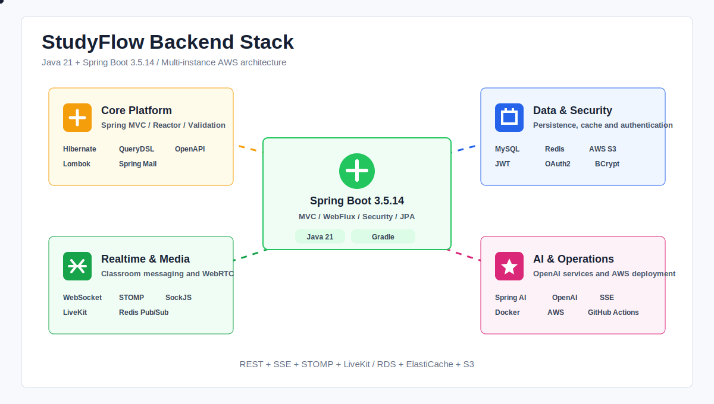
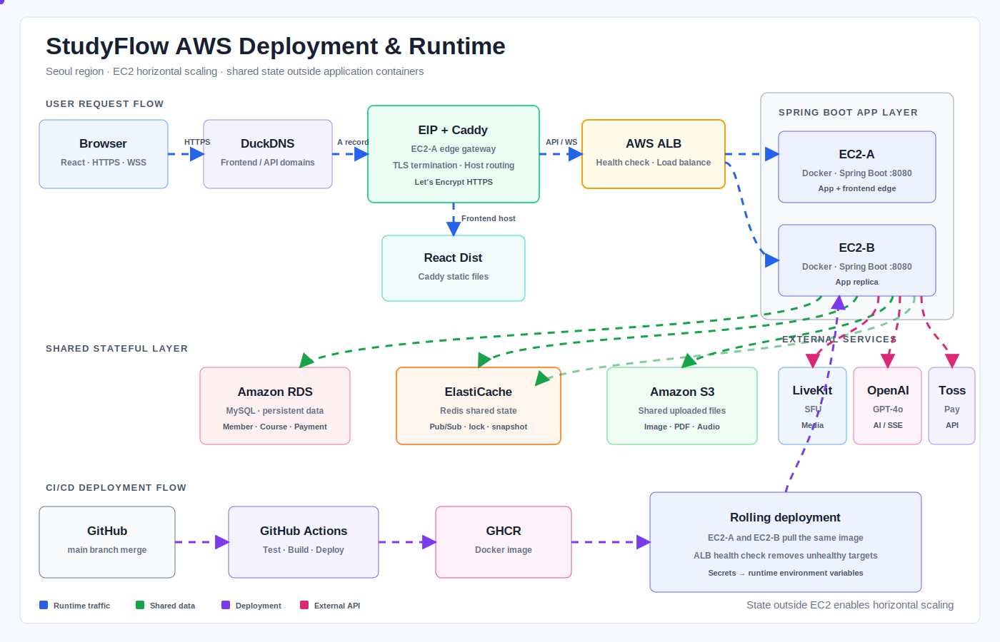

# StudyFlow Backend

<div align="center">
  <strong>실시간 수업부터 질문과 복습까지 연결하는 온라인 과외 학습 플랫폼</strong>
  <p>LiveKit 화상수업, 서버 권위 화이트보드, AI 답변 스트리밍, 채팅, 오답노트와 결제를 하나의 학습 흐름으로 제공합니다.</p>
</div>

<p align="center">
  
</p>

<p align="center">
  <a href="./docs/assets/backend-stack-animated.svg">애니메이션 기술 스택 크게 보기</a>
</p>

---

## 프로젝트 소개

StudyFlow는 선생님과 학생을 연결하고 수업 탐색, 수강 신청, 실시간 화상수업, 질문, 복습과 결제까지 지원하는 교육 플랫폼입니다.

백엔드는 다음 역할을 담당합니다.

- JWT/OAuth2 기반 인증과 역할별 인가
- 수업 등록, 검색, 수강 신청과 승인
- LiveKit 입장 토큰과 강의실 세션 관리
- WebSocket/STOMP 기반 채팅·화이트보드·오디오·퀴즈 동기화
- Redis 기반 서버 권위 상태와 멀티 인스턴스 메시지 릴레이
- Spring AI 기반 OpenAI 답변 및 SSE 스트리밍
- 질문게시판, 오답노트와 복습 추천
- 마일리지 충전, 수강료 정산, 구독권과 Toss Payments 결제
- S3 파일 저장, 이메일 인증, 알림과 관리자 기능

프로젝트 기간: **2026년 5월 19일 ~ 2026년 6월 26일**

---

## 핵심 설계

| 영역 | 설계 |
| --- | --- |
| 실시간 미디어 | LiveKit SFU가 카메라, 마이크와 화면공유를 처리 |
| 수업 도구 동기화 | WebSocket/STOMP가 화이트보드, 채팅, 오디오, 퀴즈 이벤트를 처리 |
| 서버 권위 상태 | 화이트보드·PDF 페이지·오디오 재생 상태를 Redis에 저장 |
| 멀티 인스턴스 | Redis Pub/Sub으로 EC2별 Spring Simple Broker를 연결 |
| 동시성 제어 | Redis 분산 락과 ShedLock으로 상태 변경 및 스케줄러 중복 실행 방지 |
| AI 응답 | Spring AI의 `Flux` 응답을 SSE로 전달하고 JPA 저장은 `boundedElastic`으로 분리 |
| 영속 데이터 | MySQL RDS, Spring Data JPA와 QueryDSL 사용 |
| 파일 | 로컬 개발은 디스크, 운영 멀티 인스턴스는 S3 사용 |

---

## 기술 스택

| 구분 | 기술 |
| --- | --- |
| Language | Java 21 |
| Framework | Spring Boot 3.5.14 |
| API | Spring MVC, Bean Validation, SpringDoc OpenAPI |
| Reactive | Spring WebFlux, Reactor `Flux`, SSE |
| Persistence | Spring Data JPA, Hibernate, QueryDSL 5.1 |
| Database | MySQL 8, H2(Test) |
| Cache / State | Redis, Redis Pub/Sub, Redis distributed lock |
| Security | Spring Security, JWT, OAuth2, BCrypt |
| Realtime | WebSocket, STOMP, SockJS |
| Media | LiveKit, WebRTC SFU |
| AI | Spring AI 1.0, OpenAI `gpt-4o` |
| Storage | AWS S3 |
| Payment | Toss Payments |
| Infrastructure | AWS EC2, ALB, RDS, ElastiCache, S3 |
| DevOps | Docker, Docker Compose, GitHub Actions |
| Build / Test | Gradle, JUnit 5, Mockito |

---

## 주요 기능

### 회원과 인증

- 이메일 인증, 회원가입, 로그인, 로그아웃과 회원 탈퇴
- Access Token 재발급 및 Refresh Token Rotation
- Kakao, Google, Naver 소셜 로그인
- 비밀번호 재설정과 로그인 기록
- 학생·선생님·관리자 역할 기반 접근 제어

### 수업과 수강

- 수업 등록, 검색, 상세 조회와 수정
- 수강 신청, 선생님 승인, 수강 포기
- 마일리지 잔액 검증과 승인 시점 수강료 차감
- 선생님 수익 내역과 수업 진행 시간 기반 보상

### 실시간 강의실

- LiveKit 기반 화상·음성·화면공유
- 서버 권위 화이트보드와 `seq/snapshot/resync`
- PDF 업로드, 페이지 이동과 판서 동기화
- 오디오 업로드, 재생·정지·위치·배속·AB 반복 동기화
- 강의실 채팅, 반응, 판서 권한과 실시간 퀴즈
- Redis Pub/Sub을 통한 다중 EC2 사용자 브로드캐스트

### 학습과 AI

- 과목별 AI 질문과 대화 맥락 유지
- OpenAI 답변 토큰 SSE 스트리밍
- 이미지 첨부와 AI 생성 이미지 저장
- 질문게시판 답변과 채택
- 질문게시판·AI 답변을 오답노트로 복사
- 오답노트 CRUD, 과목별 탐색, 복습 추천과 복습 결과 기록

### 결제와 구독

- Toss Payments 기반 마일리지 충전
- 결제 검증과 마일리지 거래 이력
- AI 질문권과 Live 강의 구독권
- 학생 잔액 부족 시 신청·승인 제한과 알림

---

## 팀 역할 분담

아래 역할은 프론트엔드와 백엔드를 합친 프로젝트 전체 기준입니다.

| 팀원 | 담당 기능 |
| --- | --- |
| **이재섭 (congsoony)** | 팀장·발표, 실시간 강의실, 서버 권위 화이트보드, PDF·오디오 동기화, Redis 멀티 인스턴스 대응, 채팅·보이스톡, 질문게시판, AI 질문/SSE, 오답노트·복습 추천, 마일리지 충전·결제·수익 내역, 부하테스트와 AWS 운영 검증 |
| **김현우 (gusdnzla26-art)** | 수업 상세 페이지, 학생 수강 포기, 수업 수정 제한, 화상수업 진행 시간 기반 내공 지급, 마이페이지 탭과 라우팅 개선 |
| **이준영 (leejy1019)** | 수업·선생님 찾기, 찾기 페이지 노출 토글, 학생·선생님 상세, 수업 등록·수업별 페이지, 알림, 강의실 미리보기, 선생님 마이페이지 프로필·인증 |
| **전우현 (jwh039)** | Spring Security, JWT 파싱과 역할별 인증·인가, 이메일 인증, 회원가입·로그인·소셜 로그인·로그아웃·회원 탈퇴, Access Token 재발급과 RTR, 비밀번호 재설정, 로그인 기록, 선생님 인증 승인·거절과 회원 통계 |

---

## 프로젝트 구조

```text
src/main/java/com/studyflow/
├── domain/
│   ├── auth/           # JWT, OAuth2, 이메일 인증
│   ├── user/           # 사용자 공통
│   ├── teacher/        # 선생님 프로필과 인증
│   ├── student/        # 학생 프로필
│   ├── course/         # 수업 등록과 검색
│   ├── enrollment/     # 수강 신청과 관리
│   ├── classroom/      # LiveKit, 화이트보드, 오디오, 채팅, 퀴즈
│   ├── ai/             # Spring AI와 SSE
│   ├── qna/            # 질문게시판
│   ├── wrongnote/      # 오답노트와 복습
│   ├── chat/           # 개인·수업 단체 채팅과 보이스톡 시그널링
│   ├── payment/        # Toss Payments
│   ├── credit/         # 마일리지와 정산 이력
│   ├── subscription/   # AI·Live 구독권
│   ├── file/           # 로컬/S3 파일
│   ├── notification/   # 알림
│   └── admin/          # 관리자와 통계
└── global/
    ├── auth/           # JWT 필터와 인증 처리
    ├── config/         # Security, Redis, S3, Swagger 설정
    ├── realtime/       # Redis WebSocket 릴레이
    ├── redis/          # Redis 키와 분산 락
    ├── storage/        # Local/S3 저장소 구현
    ├── websocket/      # STOMP 설정과 인증 인터셉터
    └── exception/      # 공통 예외 처리
```

---

## 로컬 실행 방법

### 요구사항

- JDK 21
- Docker Desktop
- Git
- OpenAI API Key: AI 질문 기능을 사용할 경우 필요

### 1. 저장소와 설정 파일 준비

PowerShell:

```powershell
git clone <BACKEND_REPOSITORY_URL>
cd <BACKEND_DIRECTORY>

Copy-Item .env-example .env
Copy-Item src/main/resources/application.yml.example src/main/resources/application.yml
```

macOS/Linux:

```bash
git clone <BACKEND_REPOSITORY_URL>
cd <BACKEND_DIRECTORY>

cp .env-example .env
cp src/main/resources/application.yml.example src/main/resources/application.yml
```

### 2. MySQL과 Redis 실행

`.env`에 로컬 비밀번호를 설정합니다.

```dotenv
MYSQL_ROOT_PASSWORD=local_mysql_password
REDIS_PASSWORD=local_redis_password
```

컨테이너를 실행합니다.

```powershell
docker compose up -d
docker compose ps
```

기본 포트:

- MySQL: `localhost:3306`
- Redis: `localhost:6379`
- 데이터베이스: `studyflow`
- MySQL 사용자: `root`

### 3. `application-secret.yml` 작성

다음 파일을 새로 만듭니다.

```text
src/main/resources/application-secret.yml
```

로컬 실행 예시:

```yaml
spring:
  datasource:
    username: root
    password: local_mysql_password

  data:
    redis:
      password: local_redis_password

  ai:
    openai:
      api-key: sk-your-openai-api-key

  mail:
    username: your-email@gmail.com
    password: your-gmail-app-password

  security:
    oauth2:
      client:
        registration:
          kakao:
            client-id: local-disabled
            client-secret: local-disabled
          google:
            client-id: local-disabled
            client-secret: local-disabled
          naver:
            client-id: local-disabled
            client-secret: local-disabled

jwt:
  # 반드시 Base64로 인코딩된 32바이트 이상의 키를 사용합니다.
  secret: replace-with-base64-secret

app:
  storage:
    type: local

livekit:
  # LiveKit 기능을 사용하지 않으면 placeholder로 두어도 앱은 실행됩니다.
  api-key: your-livekit-api-key
  api-secret: your-livekit-api-secret-at-least-32-bytes
  url: wss://your-livekit-host

toss:
  client-key: test_ck_your-client-key
  secret-key: test_sk_your-secret-key
```

OAuth, SMTP, LiveKit, Toss Payments는 해당 기능을 테스트할 때 실제 발급값으로 교체합니다. 로컬 파일 저장을 사용하면 AWS 키는 필요하지 않습니다.

### 4. JWT Secret 생성

`JwtTokenProvider`가 Base64 디코딩한 키를 사용하므로 일반 문자열이 아닌 Base64 값을 넣어야 합니다.

PowerShell:

```powershell
$bytes = New-Object byte[] 32
$rng = [System.Security.Cryptography.RandomNumberGenerator]::Create()
$rng.GetBytes($bytes)
$rng.Dispose()
[Convert]::ToBase64String($bytes)
```

OpenSSL:

```bash
openssl rand -base64 32
```

출력값 전체를 `jwt.secret`에 넣습니다.

### 5. 애플리케이션 실행

Windows:

```powershell
.\gradlew.bat bootRun
```

macOS/Linux:

```bash
./gradlew bootRun
```

실행 후 확인:

- API 서버: `http://localhost:8080`
- Swagger UI: `http://localhost:8080/swagger-ui/index.html`
- OpenAPI JSON: `http://localhost:8080/v3/api-docs`

### 6. 테스트

Windows:

```powershell
.\gradlew.bat clean test
```

macOS/Linux:

```bash
./gradlew clean test
```

테스트는 H2 데이터베이스를 사용합니다.

---

## Secret 관리 원칙

다음 파일은 Git에 커밋하지 않습니다.

```text
.env
src/main/resources/application.yml
src/main/resources/application-secret.yml
```

커밋 전에 다음 명령으로 ignore 여부를 확인할 수 있습니다.

```powershell
git check-ignore .env
git check-ignore src/main/resources/application.yml
git check-ignore src/main/resources/application-secret.yml
```

| Secret | 발급·작성 방법 |
| --- | --- |
| `jwt.secret` | `openssl rand -base64 32` 또는 PowerShell 명령으로 생성 |
| OpenAI API Key | OpenAI 프로젝트에서 발급, `spring.ai.openai.api-key`에 입력 |
| LiveKit API Key/Secret | LiveKit 프로젝트 Settings에서 발급, Secret은 32바이트 이상 |
| OAuth Client ID/Secret | Kakao·Google·Naver 개발자 콘솔에서 Redirect URI 등록 후 발급 |
| Gmail App Password | Google 계정 2단계 인증 활성화 후 앱 비밀번호 발급 |
| AWS Access Key | S3 권한만 가진 IAM 사용자 또는 Role 사용, Root Key 사용 금지 |
| Toss Client/Secret Key | Toss Payments 개발자센터의 테스트 또는 운영 키 사용 |

운영 환경에서는 파일을 서버에 직접 작성하기보다 GitHub Actions Secrets, AWS Parameter Store 또는 Secrets Manager를 통해 환경변수로 주입하는 방식을 권장합니다.

---

## 주요 환경변수

| 변수 | 용도 | 로컬 필수 |
| --- | --- | :---: |
| `DB_HOST`, `DB_PORT`, `DB_NAME` | MySQL/RDS 연결 | 기본값 사용 가능 |
| `DB_USERNAME`, `DB_PASSWORD` | MySQL 계정 | 필수 |
| `REDIS_HOST`, `REDIS_PORT`, `REDIS_PASSWORD` | Redis/ElastiCache | 필수 |
| `JWT_SECRET` | JWT 서명용 Base64 키 | 필수 |
| `OPENAI_API_KEY` | AI 질문 | 기능 사용 시 |
| `MAIL_USERNAME`, `MAIL_PASSWORD` | 이메일 인증 | 기능 사용 시 |
| `KAKAO_CLIENT_ID/SECRET` | Kakao OAuth2 | 기능 사용 시 |
| `GOOGLE_CLIENT_ID/SECRET` | Google OAuth2 | 기능 사용 시 |
| `NAVER_CLIENT_ID/SECRET` | Naver OAuth2 | 기능 사용 시 |
| `LIVEKIT_API_KEY/SECRET/URL` | 화상수업 | 기능 사용 시 |
| `APP_STORAGE_TYPE` | `local` 또는 `s3` | 기본 `local` |
| `S3_BUCKET`, `AWS_ACCESS_KEY`, `AWS_SECRET_KEY` | S3 파일 저장 | S3 사용 시 |
| `TOSS_CLIENT_KEY`, `TOSS_SECRET_KEY` | 마일리지 결제 | 기능 사용 시 |
| `CORS_ALLOWED_ORIGINS` | 허용할 프론트엔드 Origin | 기본 `http://localhost:5173` |

---

## 배포

<p align="center">
  
</p>

<p align="center">
  <a href="./docs/assets/aws-infrastructure-animated.svg">애니메이션 AWS 인프라 크게 보기</a>
</p>

### 운영 요청 흐름

```text
사용자
 → DuckDNS
 → EIP가 연결된 EC2-A의 Caddy
 ├─ 프론트 도메인: React 정적 파일 반환
 └─ API 도메인: ALB로 전달
      → EC2-A 또는 EC2-B의 Spring Boot
```

### 상태 외부화

| 상태 | 운영 저장소 | 목적 |
| --- | --- | --- |
| 회원·수업·결제 | RDS MySQL | 애플리케이션 재배포와 무관한 영속 데이터 |
| 화이트보드·오디오·WebSocket 릴레이 | ElastiCache Redis | 두 EC2가 동일한 상태와 메시지를 공유 |
| 이미지·PDF·오디오 | S3 | 특정 EC2 로컬 디스크에 종속되지 않는 파일 공유 |
| 카메라·마이크·화면공유 | LiveKit Cloud | WebRTC 미디어 송수신과 SFU 중계 |

### CI/CD 흐름

```text
main 브랜치 병합
 → GitHub Actions 테스트·빌드
 → GHCR에 Docker 이미지 업로드
 → EC2-A와 EC2-B가 동일 이미지 pull
 → ALB 헬스체크 후 정상 인스턴스로 트래픽 분산
```

AWS 배포용 환경변수 파일:

```powershell
Copy-Item .env.aws-example .env
```

실행:

```powershell
docker compose -f docker-compose.aws.yml up -d
```

상세 절차는 [DEPLOY_GUIDE.md](./DEPLOY_GUIDE.md)를 참고합니다.

---

## API 문서

- Swagger UI: `http://localhost:8080/swagger-ui/index.html`
- OpenAPI JSON: `http://localhost:8080/v3/api-docs`

---

## License

본 프로젝트는 AIBE5 데브코스 최종 프로젝트로 제작되었습니다.